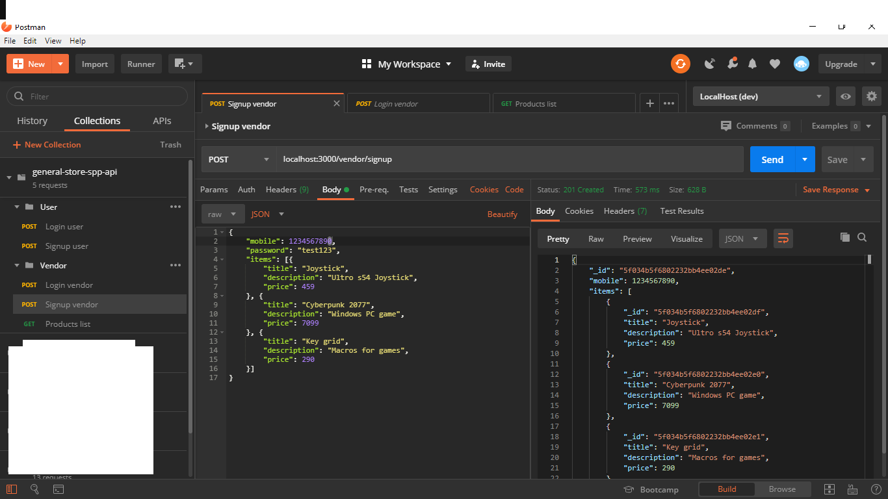

# general-store-app-api (v0.0.1)

### installing dependencies
>> npm install  

### creating development environment
* Create a new folder "config" in root of project directory.  
* Create a new file in the "config" folder named "dev.env".  
* Put bellow code insode the "dev.env" file to configure local development environment variables.  
>> PORT=3000  
>> MONGODB_URL=mongodb://127.0.0.1:27017/general-store-app-api  
>> JWT_SECRET=genstrapp001  

### running on localhost:3000
* Start mongoDB database server (assuming you already installed it from https://www.mongodb.com/)
* Now from project folder in terminal, run following command
>> npm run dev  
* Now you can use desktop app like Postman (https://www.postman.com/) or Insomia (https://insomnia.rest/) or the website    
Postwoman (https://postwoman.io/) to test the API.

## API useage

### User routes
1. signup user
    url:- localhost:3000/user/signup
    method:- POST
    req. body:- {
                    "username": "test",
                    "password": "test123"
                }
    res. body:- {
                    "_id": "5f033c821cc0830ce07ffc38",
                    "username": "test2",
                    "__v": 0
                }

2. login user
    at:- localhost:3000/user/login
    method:- POST
    req. body:- {
                    "username": "test",
                    "password": "test123"
                }
    res. body:- {
                    "_id": "5f033c671cc0830ce07ffc37",
                    "username": "test",
                    "__v": 0
                }
    res. body(error):-  {
                            "error": "invalid credentials!"
                        }

## User database model
    {
        username: {
            type: String,
            required: true,
            trim: true
        },
        password: {
            type: String,
            required: true,
            trim: true,
            minlength: 7
        }
    }

## Vendor (Shopkeeper) routes

1. signup vendor
    url:- localhost:3000/vendor/signup
    method:- POST
    req. body:- {
                    "mobile": 1234567890,
                    "password": "test123",
                    "items": [{
                        "title": "Joystick",
                        "description": "Ultro s54 Joystick",
                        "price": 459
                    }, {
                        "title": "Cyberpunk 2077",
                        "description": "Windows PC game",
                        "price": 7099
                    }, {
                        "title": "Key grid",
                        "description": "Macros for games",
                        "price": 290
                    }]
                }
    res. body:- {
                    "_id": "5f0347f03a3a701cbc08a713",
                    "mobile": 986167,
                    "items": [{
                        "title": "Joystick",
                        "description": "Ultro s54 Joystick",
                        "price": 459
                    }, {
                        "title": "Cyberpunk 2077",
                        "description": "Windows PC game",
                        "price": 7099
                    }, {
                        "title": "Key grid",
                        "description": "Macros for games",
                        "price": 290
                    }],
                    "__v": 0
                }

2. login vendor
    at:- localhost:3000/vendor/login
    method:- POST
    req. body:- {
                    "mobile": 1234567890,
                    "password": "test123"
                }
    res. body:- {
                    "_id": "5f0341c7bc3fb5064c1c6224",
                    "mobile": 1234567890,
                    "__v": 0
                }

3. Products list for the shopkeeper
    at:- localhost:3000/vendor/list
    method:- GET
    req. body:- null
    res. body:- {
                    "status": 1,
                    "items": [
                        {
                            "_id": "5f03461443f51d2ff4f87867",
                            "title": "Joystick",
                            "description": "Ultro s54 Joystick",
                            "price": 459
                        },
                        {
                            "_id": "5f03461443f51d2ff4f87868",
                            "title": "Cyberpunk 2077",
                            "description": "Windows PC game",
                            "price": 7099
                        },
                        {
                            "_id": "5f03461443f51d2ff4f87869",
                            "title": "Key grid",
                            "description": "Macros for games",
                            "price": 290
                        },
                        {
                            "_id": "5f0347f03a3a701cbc08a714",
                            "title": "tttttttt",
                            "description": "Ultro s54 Joystick",
                            "price": 459
                        },
                        {
                            "_id": "5f0347f03a3a701cbc08a715",
                            "title": "2077",
                            "description": "Windows PC game",
                            "price": 7099
                        },
                        {
                            "_id": "5f0347f03a3a701cbc08a716",
                            "title": "uuuuuuu",
                            "description": "Macros for games",
                            "price": 290
                        }
                    ]
                }

## Vendor database model
    {
        mobile: {
            type: Number,
            required: true,
            unique: true,
            trim: true
        },
        password: {
            type: String,
            trim: true,
            required: true,
            minlength: 7,
        },
        items: [{
            title: {
                type: String,
                required: true
            },
            description: {
                type: String
            },
            price: {
                type: Number,
                required: true
            }
        }]
    }
